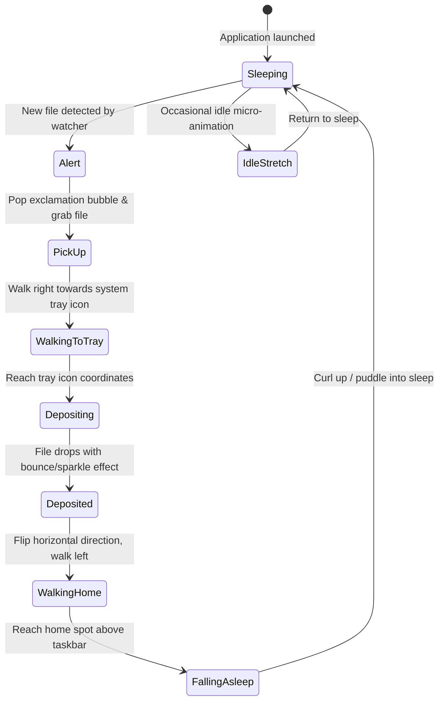

# Desktop Companion ("Pet") Architecture & Implementation Plan

This document outlines the architecture, visual design, and implementation roadmap for adding an animated desktop companion (pet) to **Dir-Watcher**.

---

## 1. Character Roster & Visual Design

The pet is designed with a pluggable character system so users can switch between companions via the tray menu or settings.

### Primary Roster

| Character | Personality / Walk Style | Carry Style | Sleep Style | Priority |
| :--- | :--- | :--- | :--- | :--- |
| **Slime (Bouncy Blob)** | Bounces, squashes & stretches | Balances the file right on top of its jelly head | Deflates into a cozy puddle with Zzz particles | **Phase 1 (Active)** |
| **Neko (Pixel Cat)** | Classic desktop companion trot, tail flick | Carries document in mouth / paws | Curls into a circle, occasional ear twitch | **Phase 2 (High)** |
| **Shiba / Dog** | Excited running hop, wagging tail | Holds file proudly, drops like a fetch toy | Sleeps on side with gentle breathing animation | **Phase 3** |

---

## 2. Animation State Machine

The character runs a 24-frame animation cycle or 12–24 FPS sprite playback with smooth 60 FPS sub-pixel screen translation.



### State Specifications

1. **`Sleeping`**:
   - Stationed at its "home" coordinate (default: bottom-right near tray or bottom-left).
   - Loops gentle breathing / snoring frames with drifting pixelated `Zzz` particles.
2. **`Alert`**:
   - Triggered when `watcher.rs` detects a file creation or rename event.
   - Character wakes up, plays a 3–4 frame surprise hop with an exclamation `!` above its head.
3. **`PickUp`**:
   - Produces a file paper icon that attaches to the character's carry anchor (top of head for Slime, mouth for Neko).
4. **`WalkingToTray`**:
   - Moves along `Y = taskbar_top - character_height`.
   - Velocity lerped toward tray coordinates `(tray_x, tray_y)`.
5. **`Depositing`**:
   - Plays a drop/toss animation.
   - The file shrinks or pops with a star particle effect into the system tray icon.
6. **`WalkingHome`**:
   - Sprite flips horizontally (`uv.min.x` / `uv.max.x` mirrored) and walks back to the home coordinate.
7. **`FallingAsleep`**:
   - Yawn, settling animation, transitions back to `Sleeping`.

---

## 3. Desktop Integration & Windows Taskbar Anchor

### Finding the Taskbar & System Tray (Win32)
1. **Taskbar Bounds**:
   - Query `FindWindowW("Shell_TrayWnd", ...)` via Win32 API (`windows-sys`).
   - Call `GetWindowRect` to obtain the taskbar rectangle (`top`, `bottom`, `left`, `right`).
   - Calculate baseline:
     ```rust
     let character_y = taskbar_rect.top - character_pixel_height;
     ```
2. **Tray Notification Area**:
   - The notification icon tray is a child window named `TrayNotifyWnd` inside `Shell_TrayWnd`.
   - Querying `FindWindowExW(shell_tray, 0, "TrayNotifyWnd", ...)` gives the exact screen coordinate where the pet deposits the file.
3. **Future Cross-Platform Extensibility**:
   - Linux: StatusNotifierItem position / X11 root window / Wayland layer-shell protocol.
   - macOS: Dock position via `NSScreen.visibleFrame` vs `NSScreen.frame`.

---

## 4. Windowing & Rendering Architecture

Using `eframe` 0.31 multi-viewport support to spawn a secondary lightweight overlay:

```rust
egui::ViewportBuilder::default()
    .with_title("dir-watcher-pet")
    .with_transparent(true)
    .with_decorations(false)
    .with_always_on_top(true)
    .with_taskbar(false) // Do not appear in Windows taskbar
    .with_mouse_passthrough(true) // Click-through by default
    .with_inner_size([character_width, character_height])
    .with_position([pet_x, pet_y])
```

- When the user hovers or clicks, we can optionally disable mouse passthrough to allow petting / dragging the character.

---

## 5. Event Pipeline

In `src/watcher.rs`:
```rust
pub enum PetEvent {
    FileCreated { path: PathBuf, filename: String },
    FileOrganized { path: PathBuf },
}
```

- **Queue Handling**:
  - If a single file lands: standard cycle (Sleep -> PickUp -> Deliver -> Return).
  - If a batch download occurs (e.g. 5 files land simultaneously): the pet either stacks the files comically high or enters "hurried courier mode" making rapid runs.

---

## 6. Configuration Additions (`config.yaml`)

```yaml
pet:
  enabled: true
  character: "slime" # "slime" | "neko" | "dog"
  scale: 2.0         # 1.0 (original pixel size) to 3.0
  speed: 160.0       # Movement speed in pixels per second
  home_offset_x: 200 # Pixels to the left of the tray area
  sound_effects: false
```

---

## 7. Implementation Steps

1. **Step 1: Spritesheet & Animation Engine (`src/pet/`)**
   - Create `src/pet/mod.rs`, `src/pet/animation.rs`, `src/pet/character.rs`.
   - Embed base spritesheet assets (Slime + file icon).
   - Frame slicing, timing controller, and sprite renderer.
2. **Step 2: Win32 Taskbar & Tray Anchor Locator**
   - Implement `src/pet/taskbar_win32.rs` using `windows-sys`.
   - Expose clean `get_taskbar_bounds()` and `get_tray_target()`.
3. **Step 3: Viewport Lifecycle in `src/app.rs`**
   - Hook the transparent pet viewport into the main eframe loop.
   - Add state update loop with delta-time movement.
4. **Step 4: Watcher Integration & Multi-file Queue**
   - Channel sender from `handle_new_file()` in `src/watcher.rs` to the pet controller.
5. **Step 5: Neko (Cat) & Dog Asset Integration**
   - Implement the Neko sprite sheet and custom animations (ear twitch, tail flick).
   - Add character switching in the Tray Menu and Settings UI.
